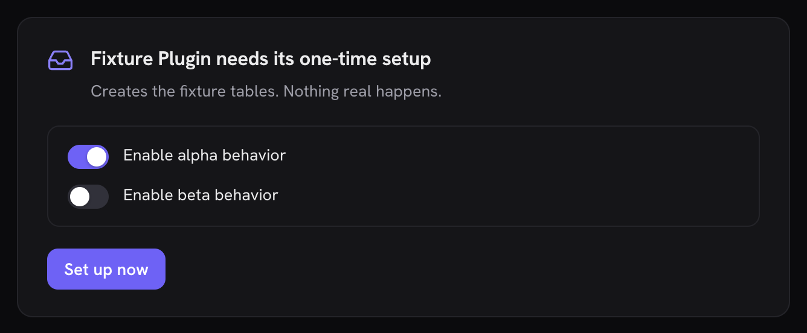
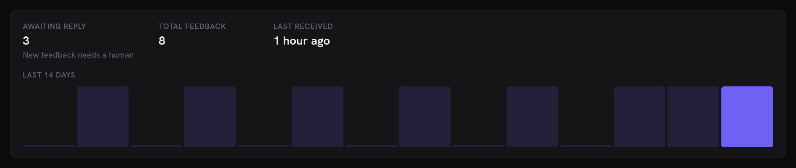
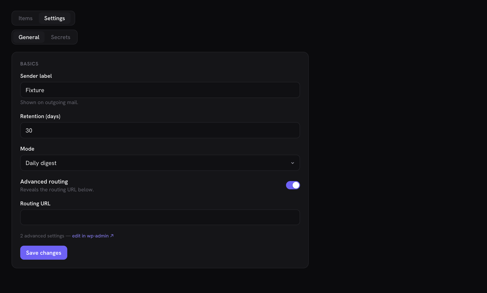
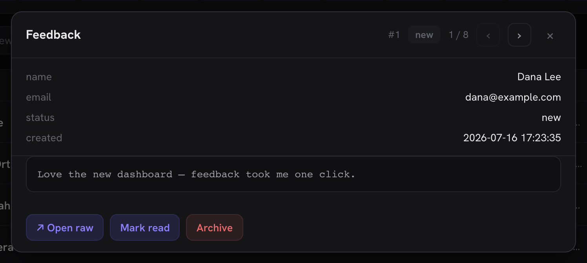
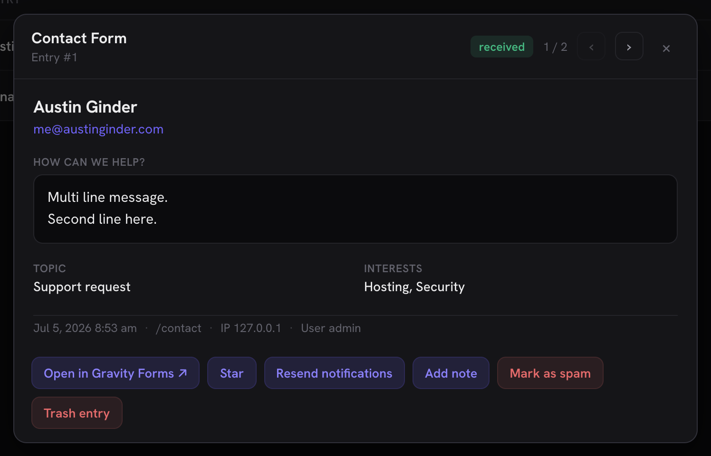
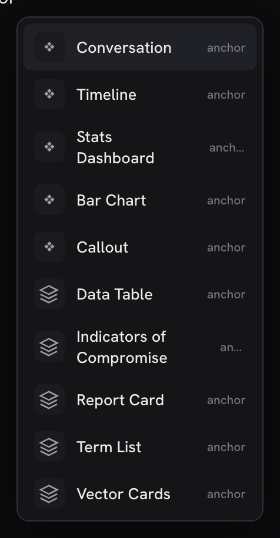
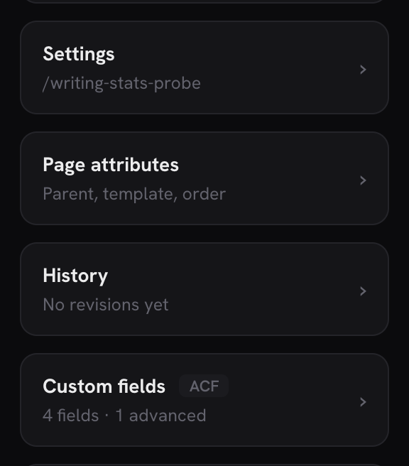
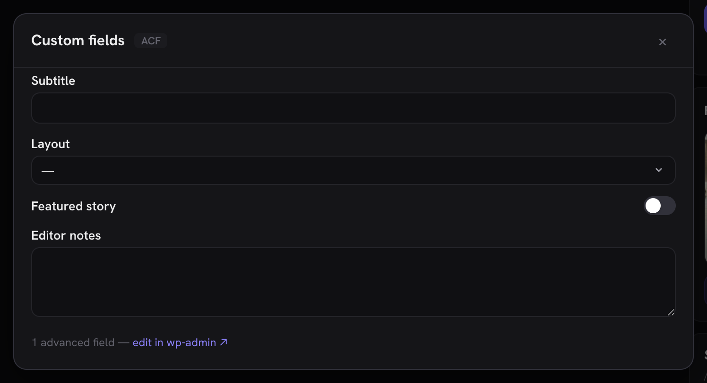

# Adding your plugin to Hero Admin

Hero Admin renders third-party plugin data through **surfaces**: declarative descriptors
registered from PHP. One filter, no JavaScript, no build step. Most plugin admin screens are
one of three shapes (a list, a detail view of one item, a few stat numbers), and Hero draws
all three with the same list / tabs / detail-modal / action primitives that power its
built-in views.

## Quick start

```php
add_filter( 'hero_admin_surfaces', function ( $surfaces ) {
    $surfaces['my-plugin'] = array(
        'label'      => 'Submissions',          // sidebar + page title
        'sub'        => 'My Plugin',            // small badge next to the title
        'icon'       => 'inbox',                // one of Hero's icon names
        'cap'        => 'manage_options',       // checked server-side before the surface is exposed
        'collection' => array(
            'route'     => 'my-plugin/v1/submissions',   // any REST route, called with cookie + nonce
            'pageQuery' => 'per_page=25&page={page}',    // {page} is filled in by Hero
            'itemsKey'  => 'items',   // key of the item array in the response (omit if the response IS the array)
            'totalKey'  => 'total',   // key of the total count (omit to use the X-WP-Total header)
            'columns'   => array(
                array( 'key' => 'title',  'label' => 'Title',  'format' => 'title' ),
                array( 'key' => 'email',  'label' => 'Email' ),
                array( 'key' => 'status', 'label' => 'Status', 'format' => 'pill' ),
                array( 'key' => 'date',   'label' => 'Date',   'format' => 'ago' ),
            ),
        ),
    );
    return $surfaces;
} );
```

That's a working, paginated, capability-gated view in the Hero sidebar.

**Your data lives in a custom table with no REST route?** That's the majority case, and it
has its own start-to-finish walkthrough: [the shim tutorial](shim-tutorial.md), which builds
a small REST shim plus this descriptor for a fictional plugin. The finished code ships as a
real, working plugin you can copy ([`docs/examples/hero-example-adapter/`](examples/hero-example-adapter/hero-example-adapter.php)),
and Hero's own test suite drives it end to end, so the example can never drift from the
contract. This is what that tutorial's finished surface looks like, built entirely from
declarative keys documented on this page:


**Building a forms plugin?** After the tutorial, the
[first-class Forms provider recipe](#make-your-forms-plugin-a-first-class-forms-provider)
covers the forms-specific machinery: per-form tabs, `entry-summary` columns, the
contact-card entry detail, the Entries/Forms switcher and the `forms` family.

## Test your integration

- **The Integrations card is your build-time debugger.** Open Hero's System page
  (`/hero-admin/system`) and find **Integrations**: it lists every registered surface,
  editor panel, design source, cache purger, page builder and hook listener, attributes
  each to the plugin that registered it, and flags contract problems (unknown keys,
  missing routes, columns without keys). A descriptor the app quietly can't render
  explains itself there, and the card's copy-report carries the section for bug reports.
- **Try it in a disposable WordPress.** Hero's readme has a one-click
  [WordPress Playground](https://playground.wordpress.net/) badge that boots a demo site
  with Hero installed: upload your plugin zip there and your surface is testable without
  touching a real site. The boot also preactivates the shim tutorial's example plugin
  (the **Feedback** surface, seeded with demo rows), so a working instance of this API is
  one click away before you write anything.
- **Test as a non-admin.** Your descriptor's `cap` hides the surface from users without
  it, but your routes' `permission_callback` is the real boundary: log in as an editor
  or author and confirm both layers agree.

## Ship the adapter inside your own plugin

Put your `add_filter()` / `add_action()` calls in one file inside **your** plugin and
require it unconditionally:

```
my-plugin/
└── includes/hero-admin.php   ← all your hero_admin_* filters live here
```

No `class_exists( 'Hero_Admin' )` guard is needed: when Hero isn't installed the filters are
simply never applied, so the integration is a free no-op. Users who install both plugins get
the integration automatically: nothing to configure, no companion plugin to ship.

Hero bundles adapters (in `includes/adapters/`) only for popular plugins that don't know about
Hero: Gravity Forms, ACF, Redirection, the analytics providers. If you're the author of the
plugin being integrated, ship the adapter with it instead; [Anchor Blocks](https://github.com/anchorhost/anchor-blocks)
does exactly this in `app/HeroAdmin.php`.

Label and description strings in descriptors are yours: run them through `__()` in your own
text domain if your plugin is translated. Hero renders them verbatim (escaped, never parsed).

## Building with an AI agent

The descriptor contract suits agentic coding unusually well: it is declarative, validated
live, and verifiable in a browser. If you're wiring your plugin in with an AI coding tool,
hand it three things (this document, [the shim tutorial](shim-tutorial.md), and the
[example plugin](examples/hero-example-adapter/hero-example-adapter.php)) and tell it to
verify against the Integrations card (`/hero-admin/system`) when it thinks it's done. The
example plugin doubles as a known-good reference the agent can diff its work against.

## Compatibility

The hooks in the [hook reference](#hook-reference) below, and the descriptor keys
documented on this page, are Hero's integration contract. The intent is that it changes
rarely, and additively:

- New hooks and descriptor keys may appear in any release; documented keys keep their
  meaning.
- If a documented hook or key ever has to change, the old form keeps working for a
  deprecation window and the change is called out in the changelog.
- Keys you find in Hero's bundled adapters but not on this page are internal and may
  change without notice. If you need one, open an issue so it can be documented and
  stabilized here.
- Declaring a key an installed Hero doesn't know yet is safe: the renderer ignores
  unknown keys (the feature is simply absent on that install) and the Integrations card
  may flag them as unknown. No version detection needed: degrade is the design.

## Integration etiquette

WordPress admin lost the attention fight: notices became banners, menus became
billboards, and every plugin learned to shout because shouting worked. Hero's answer is
architecture, not a policy document you are asked to honor. It is worth knowing the
whole enforcement story in one place, because it changes what a good integration looks
like:

- **The validator blocks or degrades placement grabs.** Workspace placement without an
  inbox-shaped collection lands in Tools. More than 3 nav slots collapse into one. More
  than 3 default slash entries per namespace become search-only. Every intervention is
  visible on the Integrations card, attributed to your plugin.
- **Rendering is Hero's.** Descriptors are data; your HTML, CSS and JS never reach the
  document. There is no banner to inject, no button to restyle, no notice to pin.
  Off-site links always render with ↗ and are listed on the Integrations card, so an
  upsell can never look like an app action.
- **Users hold the last word.** Every surface, panel, design library and slash
  namespace can be hidden per user, the hide survives your re-registration, and there
  is no API to detect or resist it.

The consequence: labels are for naming, not marketing. A surface named for what it
does, a status card that reports state, and one well-chosen default insert will be
kept; promotional labels, nag-shaped surfaces and attention sprawl get demoted,
collapsed, or hidden by the person you were trying to reach. Attention here is earned,
and the budget is the same for everyone.

## Users can hide your integration

Since v0.17.0, every integration point can be hidden per user from Hero's own UI, and
restore lives on Your profile:

- **Surfaces**: right-click the sidebar row → **Hide for you**.
- **Editor panels**: right-click the panel's door in the editor sidebar.
- **Design libraries**: right-click your library's group heading in the block picker.
- **Slash namespaces**: right-click a namespace's group heading in the block picker.
  This hides the namespace everywhere it feeds the editor menus: auto-insertable
  blocks, `insert` templates, block patterns, and namespaced editor commands go
  together. Inspector forms stay, so existing blocks remain editable.

Hiding is a per-user choice: it survives reloads and your plugin's re-registration,
and there is no API to detect or resist it. Design accordingly. An integration that
earns its place gets kept; anything that grabs attention gets hidden, and the
descriptor model gives you no way to ask for it back.

## Attention budgets

Since v0.17.0, placement and count limits are enforced by the validator and the
client, not by convention. Nothing is ever dropped; overflow degrades to a quieter
form:

- **Workspace placement** requires an inbox-shaped collection (at least one `ago`
  column). A surface claiming `group: 'workspace'` without one is shown under Tools,
  and the Integrations card flags it.
- **Nav slots**: one plugin holds at most **3**. Past that, your family-less surfaces
  collapse into a single nav item (and a single ⌘K palette row) with the same switcher
  users already know from provider families. Surfaces that declare a real `family`
  keep it; a family is already a collapsed slot.
- **Default slash menu**: one namespace holds at most **3** entries in the unfiltered
  `/` menu, counted in registration order (editor commands first, then block `insert`
  templates). Overflow becomes search-only: it still surfaces the moment the user
  types, exactly like auto-insertable blocks, and the block picker (Browse all) always
  shows everything.

If your integration needs more room than the budget allows, that is the signal to
consolidate: one surface with `views`, one command that opens your own screen, one
well-chosen default insert. The budget is per plugin either way; registering more
does not buy more attention.

## External links are always marked

Since v0.17.0, every link your descriptor supplies (action `href`, status-card action,
`setup.href`) opens in a new tab, and any link whose host differs from the site's own
renders with the ↗ affordance. Hero adds the mark at render time; you cannot opt out,
and a label that already ends in ↗ is left alone. Same-site links (wp-admin deep links,
your own REST endpoints) stay unmarked: they are honest app escapes, not exits.

Off-site hrefs carried in the descriptor itself are also listed per surface on the
System page's Integrations card, attributed to your plugin. That listing is
informational, not a contract problem: linking out to your own docs or a vendor screen
is a legitimate pattern. It exists so an off-site link can never hide inside a surface
unnoticed. Links your routes return at runtime (status-card responses) can't be flagged
there, but they get the same ↗ treatment when rendered.

The plain statement: labels are for naming, not marketing. A row action that leaves the
site will always look like one.

## Descriptor reference

Only three things are load-bearing: `label`, `collection.route`, and `collection.columns`
(each column needs `key` and `label`). Everything else on this page is optional and
additive: start with the quick start's shape and grow it. Keys marked with a version
arrived in that release; unmarked keys have been stable since the API shipped.

### Top level

| Key | Meaning |
|---|---|
| `label` | Sidebar label and page title |
| `sub` | Subtitle badge (usually your plugin name) |
| `icon` | Icon name from Hero's set — the full list is under [Icons](#icons) below. An unknown name renders an empty icon, so copy from the list |
| `cap` | Capability required. Checked server-side; the surface is absent from the app for users without it. Plugins with their own access model gate inside the shim instead — see [Capability patterns](#capability-patterns) |
| `collection` | The list definition (below). Optional when the surface declares `settings`: a settings-only surface renders its settings view as the whole page (right for settings-shaped plugins with no list to show; the bundled Perfmatters adapter is the example) |
| `family` | Group id for surfaces that do the same job (`forms`, `mail`, `redirects`, `activity-log`, `snippets`, `backups`, or your own). Same-family surfaces share one sidebar entry with a provider switcher in the topbar badge; the user's pick is remembered per family |
| `group` | Sidebar placement. Three values are honored: the default **`"tools"`** (logs, redirects, snippets: site plumbing), **`"workspace"`** — for inbox-shaped surfaces, something users check daily because new items need a human (form entries are the bundled example) — and **`"network"`** for multisite surfaces that belong to the whole network rather than one site. Since v0.17.0 workspace is enforced, not asked: it requires a collection with an `ago` column (a time-ordered stream); anything else is placed under Tools and the Integrations card says so. A `network` surface is only as protected as its `cap`, so gate it on a network capability (`manage_sites`, `manage_network_options`) or it will show up for ordinary site administrators |
| `manage` | Optional **second** collection (same shape as `collection`). Adds a view switcher above the list; each collection's `viewLabel` names its tab. Use it when your surface has exactly one natural companion view — the items and the things that produce them (Gravity Forms: Entries / Forms). Need more than two? That's what `views` is for |
| `views` *(v0.13)* | Optional **further** list views beyond `collection` and `manage`: an **array** of collections (same shape as `collection`), each requiring a `viewLabel` to name its switcher tab. Entries may carry their own `cap` to gate just that view tighter than the surface (the real gate stays your route's `permission_callback`); an entry the user can't see, or one missing `route`/`viewLabel`, is dropped server-side. Views render after `manage` in the switcher and support the full collection vocabulary (tabs, search, filter, detail, actions, bulk, create). The bundled Gravity SMTP adapter uses one for its Debug log |
| `status` *(v0.10; `chart` v0.13)* | Optional status card above the list: `{ "route": "your/v1/status" }`. The route returns a server-built display model (below), so your adapter formats values server-side and the client stays generic |
| `setup` *(v0.12)* | Optional one-time setup gate (below). While your plugin still needs its own first-run install, the surface renders a setup card instead of the collection, and "Set up now" runs your installer server-side |
| `settings` *(v0.12)* | Optional settings view (below): schema-driven tabs served by your own route, rendered by Hero's form engine, saved back through your plugin's own settings APIs. Adds a Settings entry to the view switcher |

### Icons

The canonical set (an unknown name renders empty; there is no fallback glyph):

`activity` `arrow-up-right` `bell` `block` `bold` `braces` `bug` `cart` `chat` `check`
`chev` `clipboard` `clock` `code` `columns` `copy` `cpu` `database` `doc` `eraser` `file`
`focus` `gallery` `gear` `globe` `grid` `grip` `h2` `h3` `help` `img` `inbox` `italic`
`key` `link` `list` `logout` `minus` `monitor` `moon` `olist` `php` `pilcrow` `play`
`plug` `plus` `power` `quote` `refresh` `search` `send` `server` `shield` `shuffle`
`strike` `sun` `table` `tag` `toc` `trash` `undo` `upload` `users` `warn` `wp` `wrench` `x`

This list mirrors the `icon()` map in `assets/js/app.js`; editor slash commands accept the
same names (or a literal short glyph string).

### Capability patterns

Two patterns cover every bundled adapter:

1. **Plain capability.** `cap` names a WordPress capability and your routes'
   `permission_callback` checks the same one (through one shared helper, so they can't
   drift). Right whenever a core cap genuinely models who may see the data.
2. **Adapter-side gating.** Some plugins have their own access model that no single
   capability expresses: Gravity Forms admins hold `gform_full_access` rather than the
   granular caps, WP Activity Log has "only me / only admins" settings. There, declare a
   deliberately loose `cap` (`'read'`) so the surface reaches the app, and make your
   routes' `permission_callback` call the plugin's own resolver
   (`GFCommon::current_user_can_any( … )`, `Settings_Helper::current_user_can( 'view' )`).
   The route is the boundary; the descriptor cap is only UI gating.

Never check a raw granular capability that your plugin actually grants through a
resolver: a user can hold access via the resolver while failing the raw check.

### `setup` — a one-time setup gate



Some plugins need a first-run install before they work at all (Redirection
creates its tables and default group in its setup wizard; until then every
write fails). Declaring `setup` keeps the surface honest: while setup is
needed, the collection, create and actions are unreachable and the user sees
a setup card in their flow instead of a raw plugin error.

```php
'setup' => array(
    'needed'  => function () {                       // truthy = gate the surface
        return my_plugin_needs_install();            // keep it cheap: runs on app boot
    },
    'title'   => 'My Plugin needs its one-time setup',
    'note'    => 'What the setup does, in a sentence or two.',
    'options' => array(                              // optional: your wizard's questions
        array( 'id' => 'monitor', 'label' => 'Monitor permalink changes', 'default' => true ),
        array( 'id' => 'ip',      'label' => 'Store IP addresses',        'default' => false ),
    ),
    'run'     => function ( $choices ) {             // $choices: id => bool
        return my_plugin_install( $choices );        // true or WP_Error
    },
),
```

Rules:

- `needed` runs on every app load, so keep it to option reads. A throwing
  check reads as not-needed: a broken gate can never brick a working surface.
- `run` must route through **your plugin's own installer**, never a rebuilt
  copy of it. It receives the toggles as booleans (undeclared ids are
  dropped, absent ones get your declared default) and runs behind the
  surface's own `cap` via `POST hero-admin/v1/surfaces/{id}/setup`.
- Options are the place for your wizard's questions. Default privacy-relevant
  choices (IP logging, telemetry) to off; Hero will not make those choices
  silently.
- Setups Hero genuinely cannot run inline (an external auth flow, say) can
  declare `href` instead of `run`; the card renders an honest link-out and
  the surface comes alive once your setup marks itself done.

### `status` — a card above the list



For surfaces where the list alone doesn't tell the story (Disembark's Backups
view is the reference), declare `status.route` and return:

```json
{
    "rows": [
        { "label": "Last scan", "value": "3 hours ago", "hint": "142,318 files · 2.1 GB" }
    ],
    "command": {
        "label": "Back up from any terminal",
        "text": "disembark connect https://example.com abc123…",
        "hint": "Requires the Disembark CLI."
    },
    "actions": [
        { "label": "Clean up working files", "route": "your/v1/cleanup", "method": "POST", "confirm": "Really?", "danger": true },
        { "label": "Open Disembark ↗", "href": "https://example.com/wp-admin/tools.php?page=disembark" }
    ]
}
```

`rows` render as a stat strip (send display-ready strings; format server-side).
`command` renders as a click-to-copy monospace box; omit it when there's
nothing to copy. `actions` render as buttons: with `route` they POST (or
`method`) and re-fetch both the status and the list on success, `confirm`
shows a native confirm first, `danger` styles the button red, and `href`
renders a plain new-tab link instead of a request. An action may declare
`fields` (the create-field vocabulary) to become parameterized: the button
swaps for an inline form and the values merge into the request body
("Send a test email" with an address field is the bundled Gravity SMTP
reference). Omit any key you don't need; conditional actions are just
actions your route leaves out of the response.

Optional `chart` draws a compact bar series under the rows (same visual
language as the Overview traffic/activity chart). Shape:

```json
{
    "title": "Last 14 days",
    "primary": "Sent",
    "secondary": "Failed",
    "points": [
        { "label": "Jul 1", "value": 5, "secondary": 1 },
        { "label": "Jul 2", "value": 3, "secondary": 0 }
    ]
}
```

`points` is required (skip the key when empty). `label` is display-ready;
`value` is the solid bar and the first tip row. When `secondary` is present
on the chart (or on any point), bars become dual: a soft total bar
(`value + secondary`) behind the solid primary bar, with tip rows named by
`primary` / `secondary` (defaults "Count" / "Other"). Single-series charts
omit `secondary` and render one accent bar per point. The bundled Gravity
SMTP adapter is the reference (daily sent/failed from its events table).

### `settings` — a schema-driven settings view



Your plugin's settings, rendered by Hero from a schema your route serves at
runtime. Declare the tabs and one route; Hero draws the forms with the same
field engine that powers create/edit forms and editor panels, so when your
plugin adds a field, coverage updates itself with no Hero release:

```php
'settings' => array(
    'label' => 'Settings',                 // view-switcher label (default "Settings")
    'cap'   => 'manage_options',           // optional: hides the VIEW from users
                                           // without the capability (the surface
                                           // itself may be readable more widely);
                                           // your route's permission_callback is
                                           // the real write gate
    'tabs'  => array(
        array( 'id' => 'general', 'label' => 'General' ),
        array( 'id' => 'logging', 'label' => 'Logging' ),
    ),
    'route' => 'my-plugin/v1/hero-settings/{tab}',
),
```

The route implements one contract per tab:

- `GET {route}` returns the schema and current values in one response:

```json
{
    "groups": [
        {
            "title":  "Sending",
            "fields": [
                { "key": "from_name", "label": "From name", "help": "Shown on outgoing mail." },
                { "key": "retention", "label": "Retention (days)", "type": "number", "min": 1 },
                { "key": "mode",      "label": "Mode", "type": "select", "options": [ ["digest", "Daily digest"], ["instant", "Instant"] ] },
                { "key": "enabled",   "label": "Advanced routing", "type": "toggle" },
                { "key": "route_url", "label": "Routing URL", "mono": true, "showWhen": { "key": "enabled", "equals": true } }
            ],
            "locked": 2
        }
    ],
    "values":   { "from_name": "Heroow", "retention": 30, "mode": "digest", "enabled": false },
    "adminUrl": "https://example.com/wp-admin/admin.php?page=my-settings"
}
```

- `POST {route}` receives `{ "values": { … } }` holding **only the keys the
  user actually edited** and returns the same shape, fresh. Return a
  `WP_Error` to refuse a save; the message shows as a toast and the form
  keeps what was typed.

Fields use the shared form vocabulary: `key`, `label`, `type` (`text` default ·
`textarea` · `number` · `select` (rendered as Hero's themed searchable
dropdown, never a native select popup) · `combobox` (the themed autocomplete over
`options`, right for long catalogs) · `toggle` · `email` · `url`), `options`
(`[value, label]` pairs), `placeholder`, `help` (rendered under the control),
`rows`, `min`/`max`, `mono`, and `showWhen: { "key": …, "equals": … }` (the
row shows only while the controlling field holds that value, evaluated live
as the user edits). A group's `locked` count says "N advanced settings —
edit in wp-admin ↗" via `adminUrl` for anything too bespoke to render
generically.

Rules of the road:

- Because only edited keys ride the save, untouched values never round-trip
  through your sanitizers.
- **Secrets**: serve them masked with a recognizable sentinel and skip the
  write when the sentinel rides back (Gravity SMTP's `****************`
  semantics). A field the user touched but left masked must never clobber
  the stored secret.
- Read and write through your plugin's **own** settings APIs inside the
  route, so constant-lock, encryption and validation semantics stay yours.
- A surface may be **settings-only**: omit `collection` entirely and the
  settings view renders as the whole page, with no view switcher. If your
  plugin registers its options through the core WP Settings API, the bundled
  Perfmatters adapter is the reference for reading that registry as the
  schema at runtime instead of hand-copying fields.
- Settings can be **item-scoped**: a `route` containing `{id}` renders the
  settings view per item instead of globally. The Settings tab leaves the
  view switcher (there is no item yet to render), and entry happens from a
  row instead: declare an action `{ "label": "Form settings",
  "settingsItem": true }` on the list whose rows own the settings, and
  clicking it opens the settings view for that row ({id} and {tab} both
  substitute into the route; the toolbar names the item). The bundled
  Gravity Forms adapter is the reference: its Forms view's rows open each
  form's own settings, with the schema read from Gravity Forms' Settings
  framework at request time.

### `collection`

| Key | Meaning |
|---|---|
| `route` | REST route for the list. May contain `{tab}` (replaced with the active tab value) |
| `allRoute` | Route used for the "All" tab when `route` contains `{tab}` |
| `query` | Extra query string appended to every request (sorting etc.) |
| `pageQuery` | Pagination template, default `per_page=25&page={page}`. `{page}` is 1-based; use `{page0}` for zero-based APIs (Redirection). Use your API's own style, e.g. Gravity Forms' `paging[page_size]=25&paging[current_page]={page}` |
| `itemsKey` / `totalKey` | Where items/total live in the response body. Omit both for standard WP collections (plain array + `X-WP-Total` header) |
| `tabs` | Either `{ "route": "...", "valueKey": "id", "labelKey": "title" }` to build tabs from a REST call, or `{ "param": "status", "static": [["sent","Sent"],["failed","Failed"]] }` for fixed tabs sent as a query param. `allLabel` names the first tab |
| `viewLabel` | Names this collection in the view switcher (with `manage`) and in the search placeholder |
| `columns` | Array of `{ key, label, format, altKey, width, utc }`. `key` supports dot paths (`initiator_data.user_login`); `altKey` is a fallback key read when the primary is empty. Formats: `title`, `text` (default), `pill`, `ago`, `mono`, `num` (right-aligned numeric), `entry-summary` (for form-entry rows whose answers live under numeric field-id keys: renders the first few answer values as the row's summary — see any bundled forms adapter's list). `width` overrides the column's grid width; defaults are sized by format. For `ago`, bare datetimes parse as site-local: set `utc: true` for UTC-stored timestamps (or use a key ending in `_gmt`, or emit a trailing `Z`). Since v0.18.0 a column may also carry `sort`: the `{by}` token your route understands for that column (see `sortQuery` below). Columns without `sort` keep plain headers; without any sort pick, list order stays whatever your route returns, so declare your default in `query` (newest-first is the convention) |
| `detail` | Detail modal config: `detailRoute` (fetch full item by `{id}`), `sectionsRoute` (server-built display model, an alternative to `detailRoute` + `labels`, below), `labels` (resolve numeric field-id keys to human labels — the per-form fields case: `{ "route": "your/v1/forms/{form_id}/fields", "valueKey": "id", "labelKey": "label", "itemsKey": "fields" }`. `{placeholders}` in the route fill from the item, Hero maps `valueKey` → `labelKey` over the response array — or over `itemsKey` inside it — and caches the map per route URL. Fixed-schema items skip `labels` entirely: snake_case response keys already render as words), `messageKey` (render one field as a large text block — HTML messages render in a sandboxed iframe, plain text in a `<pre>`), `skip` (keys to hide), `edit` (inline editing, below) |
| `actions` | Buttons in the detail modal **and** the list-row ⋯ / right-click menu: `{ label, method, route, body, confirm, danger, when, href, fields, settingsItem, list }` — each key detailed in [the `actions` section](#collectionactions--verbs-on-rows-and-in-the-detail-modal) below |
| `sortQuery` | *(since v0.18.0)* A query-string template with `{by}` and `{dir}` (e.g. `orderby={by}&direction={dir}`). Columns carrying a `sort` token render clickable headers: first click sorts (numeric and `ago` columns start descending, everything else ascending), a repeat click flips direction, and the template is appended to the list request. Omit it and headers stay plain |
| `search` | A query-string template with `{q}` (e.g. `filterBy[url]={q}` or `search={q}`). Adds a filter box to the toolbar; the term is debounced and appended to the list request. For APIs that take search criteria as a JSON string (Gravity Forms), use the object form: `array( 'param' => 'search', 'json' => <criteria array with '{q}' where the term goes> )` — the term is JSON-escaped and the criteria double-URL-encoded to match APIs that `urldecode()` the param themselves |
| `filter` *(v0.12)* | A second list dimension beside `tabs`, rendered as a segmented control — shapes and the json-merge rule in [the `filter` section](#collectionfilter--a-second-dimension-beside-tabs) below |
| `bulk` | Bulk actions: the same shape as `actions` minus `href` (a batch always needs a `route`). Declaring any adds a checkbox column (shift-range, Select page) and a selection bar. Each action runs **per selected item** (`{id}` replaced; one failure never aborts the rest), `when` is evaluated per item so a mixed selection skips ineligible rows, a button whose `when` matches nothing on the current page isn't offered at all, and the result toast reports done / skipped / failed |
| `create` | Adds an "Add" button + form modal. `{ label, route, method, fields, defaults }` — `fields` are `{ key, label, mono, type, value, placeholder, rows, options, required }` (dot-path keys supported, e.g. `action_data.url`); `defaults` are merged under the typed values so fixed fields (group, match type) ride along. Field types: `text` (default), `number`, `textarea` (`rows` sets its height), `select` (`options` as `[value, label]` pairs), `tags` (comma-separated input, submitted as an array), `email`, `url`. Every field is required unless it declares `required: false`. A failed create (your route returning `WP_Error`) toasts your error message and keeps the form open as typed |



### `collection.actions` — verbs on rows and in the detail modal

Each action is `{ label, method, route, body, confirm, danger, when, href, fields,
settingsItem, list }`:

- **`route`** — `{id}` is replaced with the item id; `method` defaults to POST (DELETE is
  fine; several bundled adapters use it for permanent removal); `body`
  merges into the request. The route may return `{ "message": "…" }` to replace the
  default "⟨label⟩ — done" toast, the honest channel for outcomes the label can't
  promise (the bundled Gravity SMTP send-a-test reports when another active mailer
  actually carried the send).
- **`confirm`** shows a native confirm first; **`danger`** styles the button red.
- **`when: { key, equals }`** offers the button only while the item's field matches
  (Activate vs Deactivate, Mark-read only while unread).
- **`href`** renders a plain link instead of firing a request; `{field}` placeholders
  fill from the item. Links open in a new tab, and an href that leaves the site always
  renders with the ↗ affordance (see [External links are always marked](#external-links-are-always-marked)).
- **`fields`** *(v0.12)* makes the action **parameterized**: clicking swaps the button
  row for an inline form (the create-field vocabulary; every field required unless
  `required: false`) and typed values merge into `body` (dot paths supported) before the
  request fires: "Add note" and "send to ⟨address⟩" shapes. Parameterized actions stay
  **detail-only** (they need the modal's form chrome). Status-card actions accept
  `fields` the same way.
- **`settingsItem: true`** *(v0.13)* fires no request: it opens the surface's
  item-scoped settings view for the row (requires a `settings.route` containing `{id}`;
  see the settings section).
- Every non-parameterized action also appears on the list row's ⋯ / right-click menu
  (Open is always first); set **`list: false`** to keep a verb detail-only.

### `collection.filter` — a second dimension beside tabs

Rendered as a segmented control: `{ label, options, query }` or
`{ label, options, param, json }`. `options` are `[value, label]` pairs and the FIRST is
the default, always sent.

- The plain form appends `query` with `{v}` replaced (`status={v}`).
- The json form merges into the SAME criteria object as an object-form `search` when
  they share `param`. That merge is the point: Gravity Forms takes status and field
  filters inside one JSON `search` param, and two independent writers would clobber
  each other.
- Pair filters with `when`-gated actions so each filter view offers the verbs that make
  sense there (Received: Spam / Trash · Trash: Restore / Delete permanently).

### Pages versus modals

Hero's rule for when a record gets a detail modal and when it earns a full page with its
own URL: a modal is for a glance (read the record, run a quick verb, close); a record
earns a page when it has sub-resources or workflows of its own, or a URL worth sharing
with a teammate. WooCommerce orders are the precedent: the order page at `/orders/{id}`
hosts the full working surface (items, payment, refunds, emails, notes, related orders)
while Quick view stays a modal for the one-click look from the list. Both presentations
share one detail body, so neither drifts.

Plugin surfaces get the modal by design. Entries, log rows and packages are
glance-shaped, and the `sectionsRoute` detail plus row actions cover them; a surface
whose records genuinely carry sub-resources should link out to its own screen (the
`href` action) rather than simulate a page inside the modal. If Hero later promotes a
surface detail to a real page, it will be by this same test, not by popularity.

### `detail.edit` — inline editing in the detail modal

Let users edit an item's fields in place and save through your plugin's own update endpoint:

```php
'detail' => array(
    'edit' => array(
        'route'    => 'redirection/v1/redirect/{id}',   // update endpoint; {id} replaced
        'method'   => 'POST',                            // default POST
        'preserve' => array( 'match_type', 'group_id' ), // untouched fields sent along so
                                                         // your sanitizer doesn't reset them
        'fields'   => array(
            array( 'key' => 'url', 'label' => 'Source URL', 'mono' => true ),
            array( 'key' => 'action_data.url', 'label' => 'Target URL', 'mono' => true ),
            array( 'key' => 'action_code', 'label' => 'HTTP status', 'type' => 'number' ),
        ),
    ),
),
```

Each field is `{ key, label, mono, type }`: `key` supports dot paths (`action_data.url`
reads and writes `{ "action_data": { "url": … } }`), `mono` renders a monospace input, and
`type: "number"` sends a numeric value. Edit fields accept the same vocabulary as `create`
fields (`textarea`, `select` with `options`, `tags`, `rows`, `placeholder`): both render
through the same form engine. Fields shown as inputs are hidden from the static
detail rows automatically. The bundled Redirection adapter is the reference.

### `detail.sectionsRoute` — server-built detail view

Instead of `detailRoute` + `labels`, your endpoint can return the whole display model in
one response, with labels already resolved server-side. `sectionsRoute` (with `{id}`)
must return:

```json
{
    "kind": "entry",
    "sections": [
        { "title": "Response",   "rows": [ { "label": "Email", "value": "dana@example.com", "type": "email" } ] },
        { "title": "Submission", "rows": [ { "label": "Date",  "value": "2026-07-09 14:02" } ] }
    ],
    "adminUrl": "https://example.com/wp-admin/admin.php?page=…"
}
```

`kind` picks the layout: `"entry"` renders the contact-style form-entry view (name and
email hero, message body, quiet meta), `"activity"` renders the audit-event view (who,
event message, context chips). Omit it for a plain grouped key/value view. `adminUrl`
links the item's wp-admin screen and suppresses any `href` action that points at the
same place. The bundled Gravity Forms adapter (entries) and WP Activity Log adapter
(events) are the references.

A row's `type` picks how its value renders (plain grouped layout only; the `entry`
and `activity` cards have their own structure). Since v0.18.0 the vocabulary is:

| `type` | Renders as |
|---|---|
| *(omitted)* | Plain value; multiline or long values stack under the label |
| `url` | A link opening in a new tab (`https?://` values only) |
| `email` | A `mailto:` link |
| `pill` | A status pill using Hero's shared status vocabulary (`sent`, `failed`, `active`, `locked`, …) |
| `code` | An escaped monospace block (headers, raw payloads, stack traces); scrolls past ~14 lines |
| `html-preview` | Your HTML in a fully sandboxed iframe (no scripts, opaque origin) — the honest way to show an email body or rendered template. The HTML never touches Hero's DOM |
| `kv-table` | A two-column key/value table. `value` may be an object map, an array of `[key, value]` pairs, or an array of `{ "label", "value" }` objects; capped at 60 rows |

Values are always escaped; `html-preview` is the one place your markup renders, and
only inside the sandbox.

## Make your forms plugin a first-class Forms provider

Forms plugins are the shape this API was built around, and they get extra machinery for
free. The pieces, with the exact shapes the bundled forms adapters use (Gravity Forms,
Ninja Forms, Forminator, Formidable, Fluent Forms, CF7 via Flamingo and CFDB7):



```php
$surfaces['driftwood'] = array(
    'label'      => 'Forms',
    'sub'        => 'Driftwood',
    'icon'       => 'inbox',
    'cap'        => 'read',            // adapter-side gating: your routes check your own access model
    'family'     => 'forms',           // join the Forms provider switcher
    'group'      => 'workspace',       // entries are inbox-shaped
    'collection' => array(
        'viewLabel' => 'Entries',
        // Dynamic per-form tabs: {tab} in the route + an All route.
        'route'     => 'driftwood/v1/forms/{tab}/entries',
        'allRoute'  => 'driftwood/v1/entries',
        'tabs'      => array(
            'route'    => 'driftwood/v1/forms',   // one tab per form
            'valueKey' => 'id',
            'labelKey' => 'title',
            'allLabel' => 'All forms',
        ),
        'itemsKey'  => 'items',
        'totalKey'  => 'total',
        'search'    => 'search={q}',
        'columns'   => array(
            // Answers live under numeric field-id keys → entry-summary.
            array( 'key' => 'id', 'label' => 'Entry', 'format' => 'entry-summary' ),
            array( 'key' => 'form_title', 'label' => 'Form' ),
            array( 'key' => 'created', 'label' => 'Date', 'format' => 'ago', 'utc' => true ),
        ),
        'detail'    => array( 'sectionsRoute' => 'driftwood/v1/entries/{id}/view' ),
        'actions'   => array(
            array( 'label' => 'Mark as spam', 'route' => 'driftwood/v1/entries/{id}/spam', 'when' => array( 'key' => 'status', 'equals' => 'active' ) ),
            array( 'label' => 'Export CSV ↗', 'href' => 'https://example.com/wp-json/driftwood/v1/forms/{form_id}/export?token={export_token}' ),
            array( 'label' => 'Delete', 'route' => 'driftwood/v1/entries/{id}', 'method' => 'DELETE', 'confirm' => 'Delete permanently?', 'danger' => true ),
        ),
    ),
    'manage'     => array(
        'viewLabel' => 'Forms',
        'route'     => 'driftwood/v1/forms',
        'columns'   => array(
            array( 'key' => 'title', 'label' => 'Form', 'format' => 'title' ),
            array( 'key' => 'entry_count', 'label' => 'Entries', 'format' => 'num' ),
        ),
    ),
);
```

Piece by piece:

- **`family: 'forms'`** — declare it. Same-family surfaces share one sidebar entry with
  a provider switcher in the topbar badge, and the user's pick is remembered per family.
  Coexistence with Gravity Forms (or anyone) is exactly that: your plugin becomes one of
  the providers behind the single **Forms** nav item, never a second sidebar row. The
  family also switches entry details to the contact-card layout (below) automatically.
- **Dynamic tabs** pair with `{tab}` in the route: the tabs route returns your forms
  (array, or any object whose values are the forms), `valueKey` fills `{tab}`,
  `labelKey` names the tab, and `allRoute` serves the All tab. (Static `param` tabs and
  dynamic route tabs are the two forms of `tabs`; pick one. A status dimension beside
  the form tabs is what `filter` is for.)
- **`entry-summary`** is the list column for per-form field shapes: it collects the
  item's values under **numeric keys** (field ids: `"1"`, `"2.3"`), sorts them
  numerically, and shows the first three short ones (≤ 60 chars, single-line) joined
  with `·`. Long and multi-line answers stay in the detail. If your ids aren't numeric,
  send a ready-made `summary` string on each item instead; it wins over the heuristic.
- **The entry detail** should be a `sectionsRoute` returning `kind: "entry"`, the
  contact-card layout: name and email hero, message body, quiet meta. Hero picks the
  hero and body rows from your sections: the **answers** are the section titled like
  "Response" (else the first section), the **meta** is the one titled like "Submission"
  (else the second). Within the answers, a row's optional `type` is the strongest hint
  (`name`, `email`, `textarea` or `post_content` for the message body); without types,
  labels ("Name", "Email", "Message…") and value shape (an email-looking string, a
  multi-line or 120+ char value) decide. Send `form_name` on the item and the modal is
  titled with it, subtitled "Entry #id".
- **`manage`** is the Forms companion view: the Entries/Forms switcher every forms
  plugin wants. Keep it a list (title, entry count, maybe an activate toggle via a
  `when`-pair of actions); the form **builder** stays your own UI, linked honestly with
  an `href` action (`'label' => 'Edit form ↗'`). Hero will not reimplement it.
- **Export** is an `href` action pointing at your own download endpoint, with
  `{field}` placeholders filled from the item (put a nonce or signed token in the item
  so the link is self-authorizing; action `href`s open as plain new-tab links and
  carry no REST headers). Hero has no streaming-download primitive; the honest link is
  the pattern.

The [shim tutorial](shim-tutorial.md)'s Campfire example is this recipe minus the
per-form machinery: start there for the table/shim mechanics, then add the pieces
above. For a production-grade reference of the full shape, the bundled
`includes/adapters/gravity-forms.php` is the deepest instance.

## Hook reference

Surfaces are the front door, but Hero's whole extension surface is this set of public
hooks, each with its own section below or its own contract note:

| Hook | Kind | Purpose |
|---|---|---|
| `hero_admin_surfaces` | filter | Sidebar views (lists, tabs, detail modals) — the descriptor reference above |
| `hero_admin_editor_panels` | filter | Per-post fields or status/action panels in the editor sidebar |
| `hero_admin_traffic` | filter | Overview chart traffic provider |
| `hero_admin_traffic_day` | filter | Overview traffic bar drill-down (top pages / referrers for a date window) |
| `hero_admin_block_forms` | filter | Block inspector labels/controls + slash insert templates |
| `hero_admin_insert_blocks` | filter | Prune or extend the auto-insert slash list |
| `hero_admin_page_builders` | filter | Register a full-canvas page builder |
| `hero_admin_design_sources` | filter | Register a design/template library for the slash menu + block picker |
| `hero_admin_editor_commands` | filter | Register free-form slash-menu / block-picker commands (boilerplate HTML, island templates, async routes) |
| `hero_admin_before_render_blocks` | action | Register assets before island `do_blocks` |
| `hero_admin_render_styles` | filter | Extra CSS URLs / inline CSS for island previews |
| `hero_admin_rendered_html` | filter | Rewrite one island's rendered HTML (maps, fallbacks) |
| `hero_admin_template_footer` | action | End of Hero's app document (no `wp_head`/`wp_footer`) |
| `hero_admin_cache_purgers` | filter | Join the "Clear site cache" palette command |
| `hero_admin_spam_providers` | filter | Add a provider card to Settings → Spam |
| `hero_admin_license_providers` | filter | Report your license state on the Licenses card, optionally with activate / deactivate / re-verify |
| `hero_admin_comments_enabled` | filter | Override comments detection (nav, palette, badge) |
| `hero_admin_respect_removed_menus` | filter | Return false to stop Hero's nav mirroring `remove_menu_page()` removals (since 0.26.0) |
| `hero_admin_watched_admin_menus` | filter | Adjust which admin-menu slugs map to which Hero nav items for removal mirroring (since 0.26.0) |
| `hero_admin_visibility_providers` | filter | Report an active maintenance / coming-soon / password mode (Overview banner, topbar chip, System check) |
| `hero_admin_media_folders` | filter | Feed the Media view's folder filter from your folder plugin (since 0.18.0) |
| `hero_admin_log_sources` | filter | Add a log to System's log viewer (since 0.19.0) |

Hero deliberately never fires `wp_head`/`wp_footer` (its document stays clean), so developer
tooling that wants to render into the page attaches at `hero_admin_template_footer`; the
bundled Query Monitor adapter is the reference.

## Block inspector forms — `hero_admin_block_forms`

> **Building blocks for Hero?** Start with [content-blocks.md](content-blocks.md): the north
> star (writing editor vs layout tool), the content-block contract, and when to use islands
> vs a full schema. This section is the filter/descriptor reference for that contract.
> [Anchor Blocks](https://github.com/anchorhost/anchor-blocks) `app/HeroAdmin.php` is the
> reference adapter.

Hero's editor renders complex blocks as read-only islands, and the **block inspector** (the ⚙
chip on every island) generates a config form from each block's registered attribute schema.
The schema goes a long way on its own: attributes with an `enum` render as selects, an
attribute named `content` (or holding long text) gets a textarea, and labels are humanized
from the key. What a schema can't express is the rest of the intent: a friendlier label than
the key name, human option labels, a guaranteed textarea. This filter layers that on:

```php
add_filter( 'hero_admin_block_forms', function ( $forms ) {
    $forms['my-plugin/testimonial'] = array(
        'order'      => array( 'author', 'quote', 'tone' ),   // field order
        'attributes' => array(
            'author' => array( 'label' => 'Author' ),
            'quote'  => array( 'label' => 'Quote', 'control' => 'textarea' ),
            'tone'   => array(
                'label'   => 'Tone',
                'control' => 'select',
                'options' => array( array( 'light', 'Light' ), array( 'dark', 'Dark' ) ),
            ),
            'legacy' => array( 'hide' => true ),              // keep out of the form
        ),
    );
    return $forms;
} );
```

Per attribute: `label`, `control` (`text` · `textarea` · `select` · `number` · `checkbox`),
`options` (`[value, label]` pairs, implies `select`), `hide`. Without a descriptor the
inspector falls back to schema-derived controls, so this is refinement, not requirement.
Attributes with a `source` (stored in saved HTML) are never form-edited.

Prefer expressing what you can in the attribute schema itself: declare `enum` on
fixed-choice attributes and the generic form renders a select with no descriptor at all
(and every other schema consumer benefits too). Reach for `options` only when the raw
values need human labels.

### Dynamic blocks insert automatically — no descriptor needed

If your block is **fully server-rendered** (a `render_callback` or `render` file does the
work and your JS `save()` is null), it is already insertable in Hero with zero adapter code.
For those blocks a self-closing comment is valid saved markup, so Hero auto-registers every
dynamic, top-level, inserter-visible non-core block that **renders output from a bare
comment** as a search-only slash-menu entry: it doesn't clutter the default menu, but typing
part of its title (or its namespace, so `/my-plugin` lists everything you ship) surfaces it.
Insertion drops `<!-- wp:your/block /-->` as an island, renders the real preview, and opens
the schema-driven inspector.

The render probe is the honesty gate. `is_dynamic` alone doesn't mean a bare comment is
valid: hybrid blocks (a render_callback **plus** a JS `save()` that emits wrapper HTML, or
a render that only processes saved inner blocks) render nothing standalone and would fail
Gutenberg's block validation if Hero inserted them, so they are excluded. If your block
renders empty without attributes, give it sensible defaults or ship an `insert.template`.

To make the most of the auto-insert, register your blocks well server-side:

- **`title` in PHP registration** (or `block.json`) — without it Hero falls back to a
  humanized slug ("report-card" → "Report Card").
- **`parent` / `ancestor` for child blocks, declared server-side** — declared children are
  excluded from top-level insertion, exactly like Gutenberg's inserter. A `parent` that
  only exists in your editor JS is invisible to Hero (and to every other server-side
  consumer), so your child blocks would show up as standalone inserts.
- **`supports.inserter = false`** hides a block entirely.
- **Attribute schemas in PHP** — they are what the inspector's generated form is built
  from; `enum` attributes become selects, defaults pre-fill.

Static-save blocks (HTML produced by your editor JS `save()`) never auto-insert; only your
JS can produce their markup. Give those an explicit `insert.template` below.

To suppress an auto entry without providing a template, set `'insert' => false` in the
block's descriptor. Sites can also prune or extend the whole list via the
`hero_admin_insert_blocks` filter.

### `insert` — offer the block in the editor's `/` menu

Declare starting markup and your block appears in Hero's slash menu (an explicit template
always supersedes the auto entry). It's inserted as a configurable island (real
server-rendered preview, inspector opened immediately):

```php
$forms['my-plugin/testimonial'] = array(
    'insert' => array(
        'label'    => 'Testimonial',                    // slash-menu entry
        'icon'     => '❖',                              // optional, one glyph
        'template' => '<!-- wp:my-plugin/testimonial {"author":"…"} /-->',
    ),
    // …attribute refinements as above
);
```

`template` is full raw block markup: you know your block's canonical shape (wrapper HTML,
starter children, default attrs); Hero inserts it verbatim. Only declare `insert` on blocks
that make sense at the top level (parents and standalone blocks, not children).

### `wrapperText` — editable text in an InnerBlocks wrapper

Static InnerBlocks parents often bake a heading into their saved wrapper HTML (e.g. a
conversation block's header). Declare it editable with a regex of **exactly three capture
groups**, `(prefix)(text)(suffix)`:

```php
$forms['my-plugin/panel'] = array(
    'wrapperText' => array(
        array( 'label' => 'Heading', 'pattern' => '(<div class="panel-head">)([^<]*)(</div>)' ),
    ),
);
```

The text is replaced in place only when it actually changed; an untouched wrapper stays
byte-identical. Patterns that don't match simply don't render a field, and a generic
text-run field never doubles a matched pattern (the labeled field wins). Note that Hero's
generic text runs already make wrapper text editable with no descriptor; `wrapperText` is
worth declaring when you want a labeled, single-purpose field instead of a generic "Text"
run. For a real-world reference of a block plugin shipping its own descriptors,
[Anchor Blocks](https://github.com/anchorhost/anchor-blocks) registers insert templates
and semantic labels from its own plugin (`app/HeroAdmin.php`); the filter is a no-op when
Hero isn't installed, so block plugins can ship it unconditionally.

## Island previews — free path first, adapter only when stuck

Complex blocks land in Hero as **islands**: the saved markup is preserved byte-for-byte,
and the ⚙ chip opens the inspector. Previews are not a second editor canvas. Hero POSTs the
raw markup to `hero-admin/v1/render-blocks`, runs `do_blocks()` server-side, diffs the style
queue, scopes any new CSS into `.hero-island-preview`, and sets the result with
`innerHTML`. That design is intentional: islands stay safe to serialize, never reimplement
your React UI, and still look like the front end when assets show up.

**Design for that path and most blocks need zero Hero-specific code.** When something still
looks empty, giant, or unstyled, the checklist below is the same one Hero's own adapters
follow.

### Free path (no adapter): make `do_blocks` honest

1. **Server-render meaningful HTML.** A bare `<!-- wp:your/block /-->` (or with default
   attrs) should produce visible markup. If output is empty without attrs, set attribute
   defaults in `block.json` / PHP registration, or ship an `insert.template` with starter
   markup.
2. **Register front-end styles at `init`, not only when `has_block()` finds them on a
   singular post.** Prefer `block.json` `"style": "file:./style.css"` so core registers the
   handle when the block is registered. If you use a named handle (`"style": "my-block-style"`),
   call `wp_register_style()` in the same place you `register_block_type()`. Hero (and any
   other headless `do_blocks` consumer) will then auto-enqueue on render.
3. **Do not gate styles on `is_admin()` or editor-only hooks** for the front-end stylesheet.
   Editor styles (`editorStyle`) stay editor-only; the **style** handle is what previews and
   the public site share.
4. **Size icons and SVGs in CSS** (`max-width` / `width` / `height` on the SVG or a wrapper
   class). Unconstrained SVGs look like "broken giant icons" in any CSS-less context, not
   only Hero.
5. **Prefer static or server HTML for maps / charts / carousels when possible**, or accept
   that a pure client-side shell will look empty in previews until you add a fallback
   (below).
6. **Put text and image URLs in saved HTML (or attrs that mirror that HTML).** Hero can
   already edit generic text runs and swap images inside islands without per-block code
   when the content lives in the markup.

What Hero already does for free (no adapter):

| Behavior | Mechanism |
|---|---|
| Dynamic block slash-insert | Render probe on bare comment; search-only entries |
| Schema inspector | Attr schema from `register_block_type` / `block.json` |
| Live preview HTML | `do_blocks` via `render-blocks` |
| Styles enqueued during render | Style-queue diff after `do_blocks` |
| Site + block library CSS | `editor-styles` + client scoper on `.hero-island-preview` |
| Text / image edit in islands | Generic text runs + image URL swap |
| Design libraries / patterns | Registered block patterns are automatic; libraries via `hero_admin_design_sources` (below) |
| Writing shortcuts / boilerplate | Free-form slash commands via `hero_admin_editor_commands` (below) |

### When the free path fails: diagnosis → drop-in adapter

| Symptom in Hero | Likely cause | Fix without Hero code | Drop-in adapter if you can't change that |
|---|---|---|---|
| Empty island, full in block editor | Hybrid: JS `save()` owns markup; bare comment renders nothing | Fully server-render, or ship `insert.template` with real save markup | `hero_admin_block_forms` → `insert.template` |
| Content present but huge SVGs / broken layout | Front-end CSS never registered on REST render | Register `style` at `init` (`file:./style.css` or `wp_register_style`) | `hero_admin_before_render_blocks` + `hero_admin_render_styles` |
| Looks right on front end after a visit, empty in Hero | CSS only exists as postmeta / browser-compiled cache | Emit CSS from `do_blocks` or enqueue a real stylesheet | `hero_admin_render_styles` (postmeta / warm URL); see Otter |
| Empty map / slider / Lottie shell | Server outputs a div + script; `innerHTML` never runs scripts | Server-render a static fallback (image, iframe, noscript) | `hero_admin_rendered_html` swap to iframe/static |
| Insert works, inspector empty | No attr schema server-side | Register attributes in PHP / `block.json` | `hero_admin_block_forms` labels only refine schema |
| Static-save design library | Only editor JS can author full designs | Publish serialized templates (JSON/CDN) Hero can fetch | Design source (`hero_admin_design_sources`, below) |

### Preview hooks (copy into `includes/hero-admin.php`)

All of these no-op when Hero is not installed.

**1. Register styles before render** (named handles that core would not see otherwise):

```php
add_action( 'hero_admin_before_render_blocks', function ( $blocks, $post_id ) {
	// $blocks is an array of raw markup strings for the islands being previewed.
	if ( ! hero_admin_markup_has( $blocks, 'my-plugin/' ) ) {
		return;
	}
	wp_register_style(
		'my-block-style',
		plugins_url( 'build/style.css', MY_PLUGIN_FILE ),
		array(),
		MY_PLUGIN_VERSION
	);
}, 10, 2 );

function hero_admin_markup_has( $blocks, $needle ) {
	foreach ( (array) $blocks as $raw ) {
		if ( is_string( $raw ) && false !== strpos( $raw, $needle ) ) {
			return true;
		}
	}
	return false;
}
```

Once the handle is registered, Hero's `do_blocks` + queue-diff path enqueues it the same way
the front end would.

**2. Hand CSS URLs or inline CSS directly** (postmeta caches, CSS embedded in attrs, etc.):

```php
add_filter( 'hero_admin_render_styles', function ( $styles, $blocks, $post_id ) {
	// $styles = [ 'urls' => string[], 'inline' => string, optional 'warm' => url ]
	$styles['urls'][] = plugins_url( 'build/style.css', MY_PLUGIN_FILE );
	if ( $post_id ) {
		$cached = get_post_meta( $post_id, '_my_plugin_generated_css', true );
		if ( is_string( $cached ) && $cached !== '' ) {
			$styles['inline'] .= "\n" . $cached;
		}
	}
	return $styles;
}, 10, 3 );
```

Optional `'warm' => $front_end_url`: Hero loads that URL in a hidden iframe once so a
browser-only compiler can fill a cache, then re-fetches styles (Otter atomic-wind).

**3. Rewrite HTML for JS-only shells** (maps, widgets that need a script runner):

```php
add_filter( 'hero_admin_rendered_html', function ( $html, $raw, $post_id ) {
	if ( false === strpos( $raw, 'my-plugin/map' ) ) {
		return $html;
	}
	// Parse attrs from $raw or scrape them from $html; return a static preview.
	return '<iframe src="…" style="width:100%;height:400px;border:0" loading="lazy" title="Map"></iframe>';
}, 10, 3 );
```

Prefer fixing the free path in your plugin when you can. Adapters are for constraints you
cannot change (third-party hosting of CSS, JIT compilers, legacy registration order).

### Reference adapters in Hero (read these first)

| Adapter | Teaches |
|---|---|
| `includes/adapters/otter.php` | Lazy named styles + postmeta CSS + map HTML fallback + warm URL |
| `includes/adapters/essential-blocks.php` | CSS carried inside submitted block attrs |
| `includes/adapters/stackable.php` | Design-library insert when static-save blocks cannot auto-insert |
| `includes/adapters/kadence.php` / `generateblocks.php` | Same library pattern over the plugin's own REST/cache |
| Anchor Blocks `app/HeroAdmin.php` (external) | `hero_admin_block_forms` owned by the block plugin itself |

Internal lab notes (CSS models, hybrid traps): `docs/block-suites.md`.

## Design libraries — `hero_admin_design_sources`

If your plugin ships a template library (whole sections of serialized block markup users
insert as a unit), register it as a **design source**. Designs appear as search-only
entries in the editor's slash menu and as a labeled group in the block picker (⌘/):

```php
add_filter( 'hero_admin_design_sources', function ( $sources ) {
    $sources['my-plugin'] = array(
        'label' => 'My Library',                 // block-picker group name
        'route' => 'my-plugin/v1/hero-designs',  // implements the pair contract below
    );
    return $sources;
} );
```

The route implements a two-endpoint contract:

- `GET {route}` returns the slim list:
  `{ "designs": [ { "id": "hero-1", "label": "Hero 1", "category": "Heroes" } ] }`
  (`category` is optional, shown as the entry's meta). Hero fetches it lazily on the
  first slash-menu open and caches it for the session, so keep it fast and slim.
- `POST {route}/{id}` returns the insert payload:
  `{ "template": "<!-- wp:… -->…", "block": "my-plugin/hero" }`. `template` is full
  serialized block markup (your canonical save output, Gutenberg-valid by construction;
  a single top-level block inserts as one island), and the optional `block` names the
  island's chip.

Serve content the site can actually use (free tier only if your library is gated), and
localize remote images at insert time: when Hero is installed,
`hero_admin_localize_images( $template )` (see `includes/adapters/media-localize.php`)
sideloads them into the media library and rewrites the URLs, deduping by file name.
Guard the call with `function_exists` since your route is registered even when Hero
isn't. Give the routes a `permission_callback` (`edit_posts` matches the editor). The
bundled Stackable, Kadence and GenerateBlocks adapters register through this same
filter and are the references.

## Editor slash commands — `hero_admin_editor_commands`

When your plugin wants a **writing action** rather than a block (boilerplate paragraphs,
a pre-built island template, or markup fetched from your REST API), register a
slash-menu command. Commands appear in the editor's `/` menu and the block picker (⌘/),
with no third-party JavaScript in the Hero document:



```php
add_filter( 'hero_admin_editor_commands', function ( $commands ) {
    // 1. Synchronous prose HTML (paragraphs, simple markup the serializers keep).
    $commands[] = array(
        'id'         => 'my-plugin/cta',
        'label'      => 'CTA boilerplate',
        'icon'       => 'send',              // lucide key or a short glyph
        'ns'         => 'my-plugin',         // badge in the slash menu; picker group
        'keywords'   => array( 'cta', 'convert' ),
        'searchOnly' => true,               // hide until the writer types a match
        'html'       => '<p><strong>Ready?</strong> Book a call this week.</p>',
    );

    // 2. Synchronous island template (serialized block markup).
    $commands[] = array(
        'id'       => 'my-plugin/callout',
        'label'    => 'Callout',
        'icon'     => 'block',
        'ns'       => 'my-plugin',
        'block'    => 'my-plugin/callout',  // island chip name; defaults to core/group
        'template' => '<!-- wp:my-plugin/callout -->…<!-- /wp:my-plugin/callout -->',
    );

    // 3. Async route: Hero POSTs/GETs and inserts the response.
    $commands[] = array(
        'id'     => 'my-plugin/latest',
        'label'  => 'Latest announcement',
        'icon'   => 'file',
        'ns'     => 'my-plugin',
        'route'  => 'my-plugin/v1/hero-command/latest',
        'method' => 'POST',                 // GET or POST; default POST
        'body'   => array( 'tone' => 'short' ), // optional JSON body (scalars only)
    );
    return $commands;
} );
```

**Exactly one** of `html`, `template`, or `route` is required. Descriptors with none or
more than one are dropped. Keys:

| Key | Required | Notes |
|---|---|---|
| `id` | yes | Stable slug (`a-z0-9_-/`) |
| `label` | yes | Slash-menu / picker title |
| `html` *or* `template` *or* `route` | one | Insert shape |
| `block` | with `template` | Island block name (default `core/group`) |
| `method` | with `route` | `GET` or `POST` (default `POST`) |
| `body` | with `route` | Shallow map of scalar values for POST |
| `icon` | no | Lucide key Hero already ships, or a short glyph |
| `ns` | no | Namespace badge + picker group (`{Ns} · commands`) |
| `keywords` | no | Extra search terms (slash menu and picker) |
| `searchOnly` | no | When true, hide until the query matches (keeps `/` curated) |

Route responses must be one of:

- `{ "html": "<p>…</p>" }` — inserted as prose (same path as a static `html` command)
- `{ "template": "<!-- wp:… -->…", "block": "my-plugin/x" }` — inserted as an island

Give the route a `permission_callback` (`edit_posts` matches the editor). The command
list rides the boot payload and the mid-session `editor-blocks` re-poll (plugin toggles
refresh it without a hard reload).

## Editor panels — per-post fields in the editor sidebar

For plugins whose data lives *inside the post* (custom fields, SEO meta), register an **editor
panel** instead of a surface. Same philosophy: a declarative descriptor, rendered by Hero.
Your panel is a quiet door row in the editor sidebar (label, badge, one-line summary) that
opens a modal with your fields:





```php
add_filter( 'hero_admin_editor_panels', function ( $panels ) {
    $panels['my-fields'] = array(
        'label'       => 'My fields',
        'sub'         => 'My Plugin',
        'cap'         => 'edit_posts',
        // Returns { groups: [ { group, fields: [ {name,label,type,choices,min,max} ], locked } ] }
        // for the post being edited. {id} = post ID (0 for new), {type} = REST base.
        'fieldsRoute' => 'my-plugin/v1/fields?post_id={id}&post_type={type}',
        'valuesKey'   => 'myplugin',   // key on the wp/v2 post response holding current values
        'writeKey'    => 'myplugin',   // key Hero writes changed values back under on save
    );
    return $panels;
} );
```

Supported field types: `text`, `textarea`, `number`, `range`, `email`, `url`, `select`, `radio`,
`true_false`, `suggest`. Report anything else in the `locked` count; Hero shows "N advanced
fields — edit in wp-admin ↗" rather than rendering something unsafe. Values ride the normal
post save (autosave included), so your plugin only needs its values readable/writable on the
post REST response (`register_rest_field` or, for ACF, the field group's "Show in REST API"
toggle).

**`suggest` (since 0.18.0)** is an async-searching picker for linked records whose option
list is too large or too live for a `select` (venues, organizers, related posts). The field
declares a `route`; Hero fetches it with `&q=` as the user types and expects a plain array of
`{ value, label }` rows (Hero prepends its own "— None" clearing row). The field's current
value in your `valuesKey` payload is `{ value, label }` (or `''` for none), and the same
shape comes back on save, so read the id from `value`. The bundled Events Calendar adapter's
venue picker is the reference.

The bundled ACF adapter (`includes/adapters/acf.php`) is the reference implementation.

### Status panels — post-scoped status and actions (since 0.25.0)

Some per-post features are not fields at all: they report state and offer verbs (send this
post as a newsletter, purge this page from a CDN, share to social). For those, register the
panel with a `statusRoute` instead of the field keys. The door shows your summary line and
opening it renders your status rows plus action buttons; Hero supplies all the UI.

```php
add_filter( 'hero_admin_editor_panels', function ( $panels ) {
    $panels['newsletter'] = array(
        'label'       => 'Newsletter',
        'sub'         => 'My Plugin',
        'cap'         => 'manage_options',
        // GET; {id} = post ID, {type} = REST base. Only fetched for saved posts.
        'statusRoute' => 'my-plugin/v1/newsletter/{id}',
    );
    return $panels;
} );
```

The status route returns everything the panel shows:

```json
{
    "summary": "Not sent · 57 subscribers",
    "tone":    "amber",
    "note":    "Optional paragraph shown above the rows.",
    "rows":    [ { "label": "Status", "value": "Not sent", "tone": "amber", "hint": "…" } ],
    "actions": [
        { "label": "Send preview to me", "route": "my-plugin/v1/newsletter/123/send",
          "body": { "send_to": "preview" }, "hint": "Sends to you@example.com" },
        { "label": "Send to all subscribers (57)", "route": "…", "body": { "send_to": "all" },
          "confirm": "This sends immediately to all subscribers.", "danger": true },
        { "label": "Send to email", "route": "…", "body": { "send_to": "custom" },
          "fields": [ { "key": "email", "label": "Email address", "type": "email" } ] },
        { "label": "Open in wp-admin", "href": "…" }
    ]
}
```

`summary` is the door's one-line state; `tone` (`green` / `amber` / `red`) tints it. Action
routes are strings you build server-side (embed the post ID yourself), POSTed with the
action's `body`. An action with `confirm` goes through Hero's themed confirm dialog
(`danger` styles it red); an action with `fields` swaps its button for an inline form and
merges the collected values into the body (the same field vocabulary as create forms).
`href` actions render as links instead. The action response may carry
`{ "message": "…", "status": { … } }`: `message` replaces the default toast and a returned
`status` repaints the panel and the door in the same round trip (otherwise Hero re-fetches
your status route). Panels never render for unsaved posts, since there is no post to report
on yet. A panel is either a fields panel or a status panel; `statusRoute` makes the three
field keys optional.

For a complete real-world implementation (status builder, action endpoint, publish gating
on the dangerous verb), see the newsletter panel in
[CaptainCore Manager](https://github.com/CaptainCore/captaincore-manager/blob/master/captaincore.php)
(search for `captaincore_newsletter_panel_status`). The whole integration lives in that
plugin; Hero ships nothing about it.

## Traffic providers — power the Overview chart

Analytics plugins can replace the Overview "Activity" chart with real traffic by answering the
`hero_admin_traffic` filter. Return daily visitor/pageview counts for the requested range plus
the previous period's visitor total (used for the delta on the Visitors stat card):

```php
add_filter( 'hero_admin_traffic', function ( $traffic, $days ) {
    if ( null !== $traffic ) {
        return $traffic; // another provider already answered
    }
    return array(
        'source'        => 'My Analytics',
        'days'          => array( // 'Y-m-d' => counts, covering the last $days days
            '2026-07-02' => array( 'visitors' => 120, 'pageviews' => 310 ),
            '2026-07-03' => array( 'visitors' => 141, 'pageviews' => 355 ),
        ),
        'prev_visitors' => 2210,  // visitor total for the $days before that
    );
}, 10, 2 );
```

Hero buckets the days to match the selected range (daily up to 45 days, weekly beyond), renders
the Traffic chart with your plugin's name as the source badge, and leads the stat cards with
Visitors and a period-over-period delta. Bundled adapters cover **Koko Analytics** (the
reference implementation), **WP Statistics**, **Burst Statistics** and **Independent
Analytics**. The first active provider answers, so a plugin registering its own adapter
should return early when `$traffic` is already non-null.

### Day drill-down — top pages for a chart bar

Clicking a Traffic bar opens a modal with the top pages (and optional referrers)
for that bar's date window. Providers answer a second filter:

```php
add_filter( 'hero_admin_traffic_day', function ( $data, $from, $to ) {
    if ( null !== $data ) {
        return $data; // another provider already answered
    }
    // $from / $to are inclusive Y-m-d calendar dates for the bar (one day
    // on the 7/30d chart; up to a week on 90d).
    return array(
        'source'    => 'My Analytics',
        'pages'     => array(
            array(
                'title'     => 'Homepage',
                'path'      => '/',
                'url'       => home_url( '/' ),
                'postId'    => 0,      // optional; >0 when the hit maps to a post
                'visitors'  => 120,
                'pageviews' => 310,
            ),
        ),
        'referrers' => array(  // optional
            array( 'label' => 'google.com', 'visitors' => 40, 'pageviews' => 55 ),
        ),
        'adminUrl'  => admin_url( 'admin.php?page=my-analytics' ), // optional footer link
    );
}, 10, 3 );
```

Return `null` (or leave `$data` alone) when you have no page breakdown for the
window; the modal shows an empty state and still offers `adminUrl` when set.
Bundled day adapters: **Koko Analytics** (`post_stats` + `paths` + referrer
tables), **WP Statistics** (`statistics_pages` for hits +
`statistics_visitor.referred` for referrers; WPS has no per-URI uniques, so
both columns report hit totals), **Burst Statistics** (`burst_statistics`
page_url/page_id + `burst_sessions.referrer`), and **Independent Analytics**
(views × resources + session referrers). Same first-non-null rule as
`hero_admin_traffic`.

## Media folders — feed the Media view's folder filter

If your plugin organizes the media library into folders, answer the
`hero_admin_media_folders` filter and Hero's Media view gains a folder
combobox fed by your data. Browse-first: Hero narrows its normal media query
to your folder's attachment ids, so search, the type tabs and pagination all
keep working, and Hero never grows a folder tree of its own. First non-null
provider wins (same rule as `hero_admin_traffic`).

```php
add_filter( 'hero_admin_media_folders', function ( $provider ) {
    if ( null !== $provider || ! defined( 'MY_FOLDERS_VERSION' ) ) {
        return $provider; // someone else answered, or we're not active
    }
    return array(
        'name'    => 'My Folders',      // named in the combobox tooltip
        'folders' => function () {
            // Flat list; parent 0 = root (Hero indents children for you).
            // id 0 is reserved: an optional "Uncategorized" row for files in
            // no folder, never treated as a parent. count is optional.
            return array(
                array( 'id' => 12, 'label' => 'Logos', 'parent' => 0, 'count' => 8 ),
                array( 'id' => 13, 'label' => 'Dark',  'parent' => 12, 'count' => 3 ),
            );
        },
        'ids'     => function ( $folder_id ) {
            // The folder's attachment ids (any order), or a WP_Error for a
            // folder this user may not browse. Hero re-orders newest-first
            // and caps at 500 before querying.
            return my_folders_attachment_ids( $folder_id );
        },
        'move'    => function ( $folder_id, array $attachment_ids ) {
            // Optional. When present, the media bulk bar gains a folder
            // picker and a Move button. Put the attachments in the folder
            // through your own machinery (0 = remove from every folder);
            // true or WP_Error. Callers hold upload_files; run your own
            // finer checks here. Omit it and Hero shows no Move control.
            return my_folders_move( $folder_id, $attachment_ids );
        },
    );
} );
```

Both callables run server-side as the browsing user (`edit_posts` floor), so
per-user folder modes work by just reading your own scoped state. The bundled
providers in `includes/adapters/media-folders.php` (FileBird, Real Media
Library, Folders by Premio) are the reference; copy whichever storage shape
matches yours (custom tables, an API, or a plain taxonomy). Since 0.18.0.

## Cache purgers — join "Clear site cache"

Hero's ⌘K palette has a "Clear site cache" command that purges every detected cache
layer, one request per provider. Caching and optimization plugins register a purger via
the `hero_admin_cache_purgers` filter:

```php
add_filter( 'hero_admin_cache_purgers', function ( $purgers ) {
    $purgers[] = array(
        'id'    => 'my-cache',   // stable slug
        'name'  => 'My Cache',   // shown in the palette entry and the result toast
        'purge' => function () {
            my_cache_flush_everything();
        },
    );
    return $purgers;
} );
```

The command is only exposed to users with `manage_options`, and your `purge` callback
runs server-side on that request; no extra capability check is needed for the common
case. Bundled providers in `includes/adapters/cache-purge.php` include LiteSpeed,
WP Rocket, W3 Total Cache, SpeedyCache, Redis Object Cache, Breeze, Nginx Helper,
Cloudflare, and more; copy any of them.

## Log sources — System's log viewer

The System page's Debug tools card lists site logs (the WordPress debug log, the PHP
error log when it is a separate file, and one source per WooCommerce log channel), each
opening a full-screen tail viewer with a source picker. A plugin that keeps its own log,
or a host mu-plugin that knows where the web server's logs live, can register a source
via the `hero_admin_log_sources` filter. Since 0.19.0.

```php
add_filter( 'hero_admin_log_sources', function ( $sources ) {
    $sources['my-plugin'] = array(
        'label' => 'My Plugin log',
        'group' => 'My Plugin',      // shown as "My Plugin · My Plugin log"
        'stat'  => function () {     // cheap: powers lists, never reads content
            $path = my_plugin_log_path();
            return array(
                'exists'   => file_exists( $path ),
                'size'     => file_exists( $path ) ? filesize( $path ) : 0,
                'modified' => file_exists( $path ) ? filemtime( $path ) : 0,
            );
        },
        'read'  => function () {     // the tail payload
            return Hero_Admin_Logs::tail_file( my_plugin_log_path() );
        },
        'clear' => function () {     // optional; omit for read-only sources
            return my_plugin_truncate_log() ? true
                : new WP_Error( 'clear_failed', 'Could not clear the log.' );
        },
    );
    return $sources;
} );
```

Source ids may use letters, digits, `:`, `_`, `.` and `-`. `Hero_Admin_Logs::tail_file()`
serves the last 256 KB with the partial first line dropped; a `read` that builds its own
payload should return the same shape (`exists`, `path`, `size`, `size_human`,
`truncated`, `content`, optional `note`). The viewer is `manage_options`-only. Hero never
guesses at web-server log paths: they are host-specific and usually outside
`open_basedir`, so registering them is deliberately left to whoever controls the host.

## Spam providers — Settings → Spam

Spam filtering plugins get a card on Hero's **Settings → Spam** page: configured state,
all-time blocked count, a few safe toggles written through your own option shape, and a
link to your full wp-admin screen. Register via the `hero_admin_spam_providers` filter:

```php
add_filter( 'hero_admin_spam_providers', function ( $providers ) {
    if ( ! defined( 'MY_SPAM_PLUGIN_VERSION' ) ) {
        return $providers; // register only while your plugin is active
    }
    $providers[] = array(
        'id'     => 'my-spam',
        'name'   => 'My Spam Filter',
        'status' => function () {
            return array(
                'configured' => (bool) get_option( 'my_spam_key' ),
                'note'       => 'One-line status shown under the name',
                'blocked'    => (int) get_option( 'my_spam_blocked_total', 0 ),
                'toggles'    => array(
                    array(
                        'id'    => 'notify',
                        'label' => 'Email me about new spam',
                        'desc'  => 'What the switch does, in one sentence.',
                        'on'    => (bool) get_option( 'my_spam_notify' ),
                    ),
                ),
                'adminUrl'   => admin_url( 'options-general.php?page=my-spam' ),
            );
        },
        'set'    => function ( $toggle_id, $on ) {
            if ( 'notify' === $toggle_id ) {
                update_option( 'my_spam_notify', $on ? 1 : 0 );
            }
        },
    );
    return $providers;
} );
```

Toggles save through `hero-admin/v1/spam` (gated on `manage_options`); `set` runs
server-side with the toggle id and the new boolean. Keep toggles to the two or three
switches a site owner actually flips; deep configuration belongs on your own screen,
which the card links to. Bundled providers (Akismet, Antispam Bee, CleanTalk) live in
`includes/adapters/spam.php` and are the references.

**Paste-a-key in place (optional).** If your filter needs an API key and you also
register a license provider (next section) with an `activate` callable, return its
provider id from `status()` as `keyProvider`. The card then renders a key field that
posts to `hero-admin/v1/licenses/action`, so the same guardrails hold: the key rides
one request, is verified and stored by YOUR code, and is never retained by Hero.
Omit `keyProvider` when the key is supplied in code (a constant or filter) or managed
cloud-side. Akismet is the reference: its card field and its Licenses row drive the
same provider.

## License state — `hero_admin_license_providers`

Extensions carries a **Licenses** card: every paid component and
connected service on the site with its state (valid / expired / invalid /
missing / unknown), read from stored options only. Reads never call a licensing
API; if your plugin is commercial (or holds a service key or account
connection), a provider makes that state visible where the site owner already
looks. An optional `category` key on the provider (`license` — the default —
`key`, or `connection`) sets the small chip on the row; use `key` for service
credentials like Akismet's and `connection` for account or site links:

```php
add_filter( 'hero_admin_license_providers', function ( $providers ) {
    $providers['my-plugin'] = array(
        'name'   => 'My Plugin Pro',
        'detect' => function () {
            return defined( 'MY_PLUGIN_VERSION' ); // installed, even if inactive
        },
        'read'   => function () {
            $status = get_option( 'my_plugin_license_status' );
            return array( array(
                'name'    => 'My Plugin Pro',
                'kind'    => 'plugin',           // or 'theme'
                'state'   => $status ? $status : 'missing',
                'key'     => (bool) get_option( 'my_plugin_license_key' ),
                'expires' => '2027-01-01',       // or 'lifetime' or ''
                'note'    => '',                 // optional one-line detail
                'stale'   => false,              // true when your cached status lapsed
            ) );
        },
    );
    return $providers;
} );
```

`read` may return several rows (one per product) and runs inside a Throwable guard,
so a broken provider drops out rather than breaking the card. Keep `read` strictly
local: option reads only, no HTTP. States roll into a Licenses health check (expired
or invalid fails it, missing or unknown warns) and the copy-as-markdown report.
Bundled readers, including generic Freemius and EDD Software Licensing coverage,
live in `includes/adapters/licenses.php`; the endpoint is
`GET hero-admin/v1/licenses` (gated on `manage_options`).

### Actions: activate, deactivate, re-verify (optional)

A provider may also declare `secret_label` plus any of three action callables, and
the card grows the matching controls (paste-to-activate field, Deactivate with a
confirm, Re-verify):

```php
'secret_label' => 'My Plugin license key',
'activate'     => function ( $secret ) {
    $res = my_plugin_activate_license( $secret ); // YOUR activation code
    return array(
        'ok'      => $res->ok,
        'code'    => $res->seats_exhausted ? 'site_limit' : ( $res->ok ? '' : 'invalid' ),
        'message' => $res->message,
    );
},
'deactivate'   => function () { /* your deactivation */ return array( 'ok' => true ); },
'verify'       => function () { /* re-check stored credentials */ return array( 'ok' => true ); },
```

Rules that make this safe, enforced by how Hero calls you and expected of your
callables: actions run only when your plugin's own code is loaded (attach them
conditionally, exactly like the bundled Elementor Pro adapter), the pasted secret
rides one request and is never stored, logged or echoed back by Hero, a failed
activation is never retried automatically (a retry can burn a paid seat), and
`site_limit` is a first-class result code so a seat problem is named instead of
buried in a generic error. Actions run through
`POST hero-admin/v1/licenses/action` (`{provider, action, secret?}`, gated on
`manage_options`); a returned `WP_Error` or a thrown exception surfaces as a plain
error result. After any action the fresh classification rides back in the same
response, so the card repaints from your stored state.

If activation happens through your own portal or an OAuth-style handshake (no
callable path for a pasted key), declare `activate_url` (a URL string or a
callable returning one) instead of `activate`: unlicensed rows then carry an
"Activate ↗" link to your screen. The bundled WPBakery entry is the reference.

If activation needs more than one credential, declare `secret_fields` and
`activate` receives an id-keyed array instead of a string (every field
required); the card renders one labeled field per secret. The bundled Divi
adapter (Elegant Themes username + API key) is the reference:

```php
'secret_fields' => array(
    array( 'id' => 'username', 'label' => 'Account username' ),
    array( 'id' => 'api_key', 'label' => 'API key' ),
),
'activate'      => function ( $secrets ) { /* $secrets['username'], $secrets['api_key'] */ },
```

## Comments detection — `hero_admin_comments_enabled`

Hero hides its Comments view, palette commands and badge when commenting is effectively
off (no post type supports comments and none exist). Plugins that manage commenting can
override the detection:

```php
add_filter( 'hero_admin_comments_enabled', function ( $enabled, $types ) {
    // $types = post types that still support comments.
    return false; // force-hide (or true to force-show)
}, 10, 2 );
```

## Site visibility — `hero_admin_visibility_providers`

When your plugin is hiding the site (a maintenance mode, coming-soon page or whole-site
password), tell Hero so the owner sees the persistent "Site hidden" chip, the Overview
banner and the System health check instead of wondering where their traffic went. Only
register while the mode is actually ACTIVE (the filter runs on every Hero pageload):

```php
add_filter( 'hero_admin_visibility_providers', function ( $providers ) {
    if ( my_plugin_maintenance_is_on() ) {
        $providers[] = array(
            'name'    => 'My Maintenance Mode',
            'id'      => 'my-plugin',   // optional: pairs the row with a toggle writer (below)
            'kind'    => 'maintenance', // or 'coming-soon' | 'password'
            'note'    => 'Visitors see the holding page',          // optional
            'url'     => admin_url( 'admin.php?page=my-settings' ), // where to turn it off
            'partial' => false, // true when only SOME pages are covered
                                // (WooCommerce's store-pages-only shape) —
                                // Hero then says "part of the site" instead
                                // of claiming the whole site is dark
        );
    }
    return $providers;
} );
```

Want the owner to be able to turn your mode off (and back on, via Undo) right from
Hero's banner, chip popover and Settings → Visibility? Register a toggle writer under
the same `id`. Hero only ever flips a mode through a writer the plugin registers;
providers without one stay honest link-outs to `url`.

```php
add_filter( 'hero_admin_visibility_toggles', function ( $toggles ) {
    // Register whenever your plugin is loaded (not only while the mode is on):
    // an Undo must be able to re-arm a mode that is currently off.
    $toggles['my-plugin'] = array(
        'set' => function ( $on, $ctx ) {
            // $ctx['kind'] is the mode that was on before Hero turned it off
            // ('maintenance' | 'coming-soon' | 'password') — use it to restore
            // the right mode if your plugin has more than one.
            my_plugin_set_maintenance( $on );
        },
    );
    return $toggles;
} );
```

The toggle endpoint (`POST hero-admin/v1/visibility/toggle`) requires `manage_options`.
Bundled detectors cover Maintenance (WebFactory), SeedProd, Under Construction,
LightStart (WP Maintenance Mode), CMP Coming Soon & Maintenance, Minimal Coming Soon,
Password Protected, WooCommerce coming soon and Elementor maintenance mode — all with
toggle writers through each plugin's own storage.

## No REST API? Ship a shim

If your data lives in custom tables, register a small read-only REST collection and point the
descriptor at it. Hero's bundled Gravity SMTP adapter
(`includes/adapters/gravity-smtp.php`) is the reference implementation: ~60 lines of SQL-to-REST
plus a descriptor. Rules of the road: check capabilities in `permission_callback`, use
`$wpdb->prepare`, and never `unserialize()` stored blobs (extract what you need with regex or
`json_decode`).

## Notes

- All requests are same-origin with the logged-in user's cookie + `X-WP-Nonce`; your existing
  REST permission checks keep working.
- Escape nothing yourself; Hero escapes every value it renders.
- Bundled adapters live in `includes/adapters/` and are guarded by `class_exists`/`defined`
  checks; PRs adding adapters for widely-used plugins are welcome. Prefer shipping the
  adapter **inside your plugin** when you own the product; Hero bundles only for plugins
  that will never know about it.
